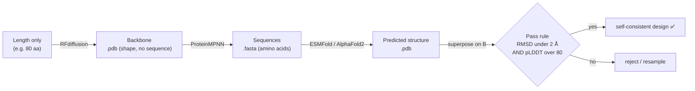
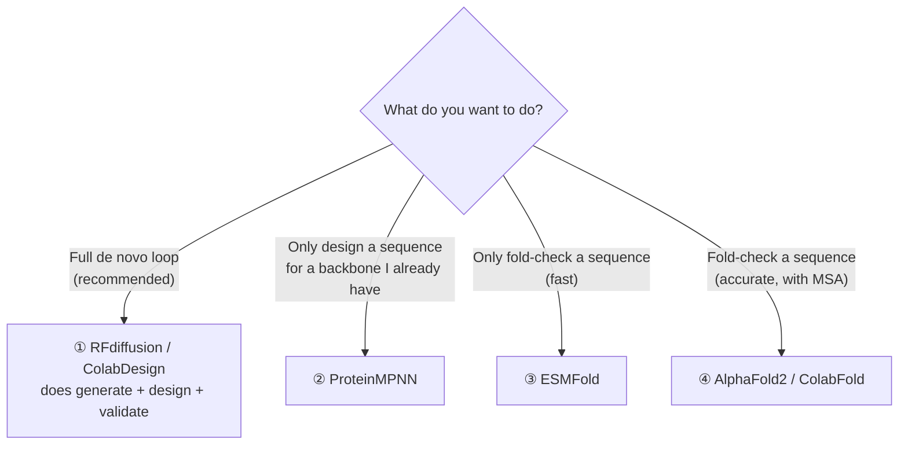
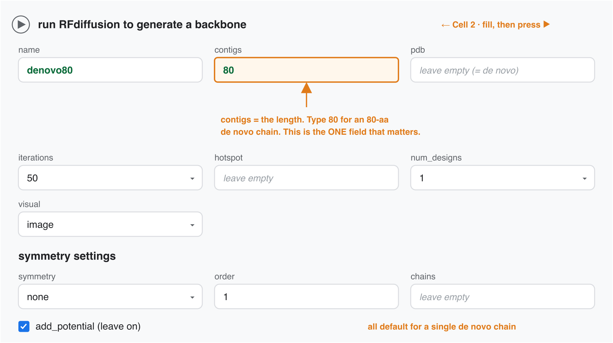
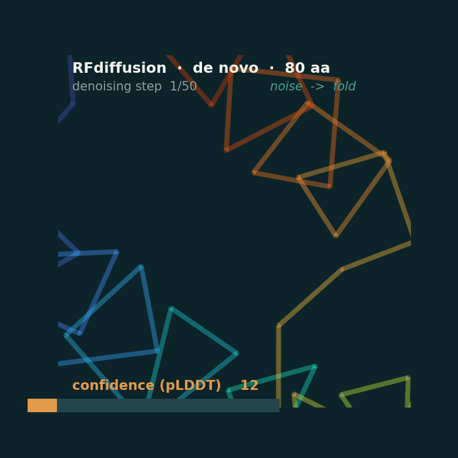
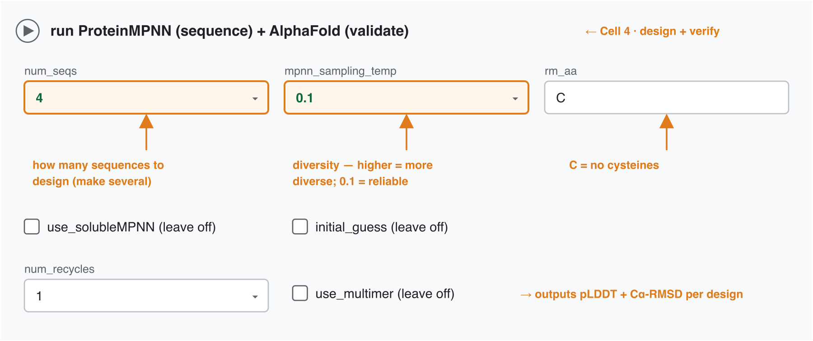
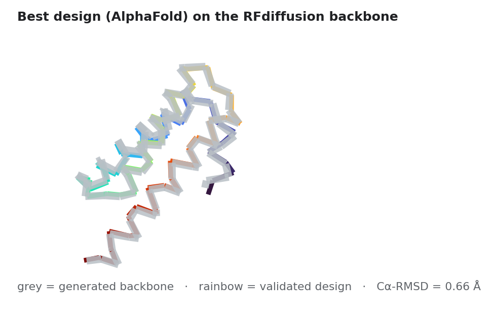

# De novo Protein Design on Colab — a step-by-step manual

Design a brand-new protein (one that does not exist in nature), then check your own work — **entirely in the browser, no install, no code**. This manual walks the **80-amino-acid example** end to end and explains **every form field: what it means and what to type**.

> **TL;DR** — for pure *de novo* design you only need **one** notebook: the **RFdiffusion (ColabDesign)** notebook already runs **RFdiffusion → ProteinMPNN → AlphaFold** in sequence. The other three notebooks are only for running a single step on its own.

---

## 0. The idea in one picture

**Two ideas only:** **GENERATE** a candidate (RFdiffusion + ProteinMPNN), then **VERIFY** it independently (ESMFold / AlphaFold2). If the verified structure lands back on the shape you generated, the design is **self-consistent**.

---

## 1. Which notebook do I open?

| # | Notebook | Link | Role | Free-GPU time |
|---|----------|------|------|---------------|
| ① | **RFdiffusion (ColabDesign)** | [open](https://colab.research.google.com/github/sokrypton/ColabDesign/blob/main/rf/examples/diffusion.ipynb) | **all-in-one**: backbone → sequence → AF2 validate | ~1–2 min / design |
| ② | **ProteinMPNN** | [open](https://colab.research.google.com/github/dauparas/ProteinMPNN/blob/main/colab_notebooks/quickdemo.ipynb) | design a sequence for a given backbone | ~1 s |
| ③ | **ESMFold** | [open](https://colab.research.google.com/github/sokrypton/ColabFold/blob/main/ESMFold.ipynb) | verify — fast, single-sequence | ~45 s (+3 min install) |
| ④ | **AlphaFold2 (ColabFold)** | [open](https://colab.research.google.com/github/sokrypton/ColabFold/blob/main/AlphaFold2.ipynb) | verify — accurate, builds an MSA | ~5 min |

---

## 2. One-time setup (every notebook)

1. Click the notebook link → it opens on **colab.research.google.com** (viewing works without login; **running needs a free Google account**).
2. **Turn on the GPU** (do this first, or everything runs slowly on CPU):
   **Runtime → Change runtime type → Hardware accelerator → T4 GPU → Save.**
3. Run cells **top to bottom**: hover a cell and click the **▶** button, or **Runtime → Run all**.
4. The first "setup" cell installs the tool (~3 min the first time). Later cells are fast.

> 💡 Colab **forms**: most cells show boxes/dropdowns instead of code. You just fill the boxes and press ▶ — you never edit code. (Tick "Show code" only if you're curious.)

---

## 3. The full de novo loop — notebook ① (RFdiffusion / ColabDesign)

This single notebook has 6 cells. Below is exactly what to run and what to type for the **80-aa example**.

### Cell 1 — `setup RFdiffusion (~3min)`
No fields. Just press ▶ once and wait for the green check. (Installs RFdiffusion + ProteinMPNN + AlphaFold.)

### Cell 2 — `run RFdiffusion to generate a backbone`  🧬 *generate the shape*

| Field | What it means | Default | **Fill for 80-aa de novo** | Notes |
|-------|---------------|---------|----------------------------|-------|
| `name` | Job name / output file prefix | `test` | **`denovo80`** | anything; names your download |
| `contigs` | **What to build.** For a plain de novo chain this is just the **length**. | `100` | **`80`** | `80` = one 80-residue chain from scratch. Ranges like `70-90` = random length in range. (Motif/binder syntax is more complex — not needed here.) |
| `pdb` | Input PDB for motif-scaffolding / binder design | *(empty)* | *(leave empty)* | **empty = pure de novo**, no template |
| `iterations` | Number of denoising steps | `50` | **`50`** | more steps ≈ cleaner but slower; 50 is the sweet spot |
| `hotspot` | Target residues a binder must touch | *(empty)* | *(leave empty)* | only for binder design |
| `num_designs` | How many backbones to generate | `1` | **`1`** (use `4`–`8` to sample more) | each one is independent |
| `visual` | Show the result as you go | `image` | **`image`** | `interactive` = rotatable 3D (a bit slower) |
| **symmetry** | For symmetric oligomers | `none` | **`none`** | keep `none` for a single chain |
| `order` | Symmetry order | `1` | *(ignore)* | only matters if symmetry ≠ none |
| `chains` | Chain labels for multi-chain jobs | *(empty)* | *(ignore)* | — |
| `add_potential` | Auxiliary guiding potentials | ✅ `True` | **✅ leave on** | helps oligomers/binders; harmless here |
| **advanced → `partial_T`** | Noising steps for *partial* diffusion | `auto` | **`auto`** | only used when you start from a pdb |
| **advanced → `use_beta_model`** | Alternate RFdiffusion weights | ☐ `False` | **☐ leave off** | *tip from the notebook:* turn on if you get **too many helices** and want better strand/helix balance |

➡️ **Output:** an 80-residue **backbone** (3-D shape, no sequence yet) + the denoising **trajectory**.

### Cell 3 — `Display 3D structure`  🎬 *watch it fold*

Set `animate = interactive` (or `movie`) to see the denoising trajectory — the backbone condensing out of noise as the model's confidence (pLDDT) climbs. This is the **actual animation from the live run** in §4:

| Field | What it means | Default | **Suggested** | Notes |
|-------|---------------|---------|---------------|-------|
| `animate` | Show the denoising **trajectory** | `none` | **`interactive`** (or `movie`) | this is the "noise → fold" animation |
| `color` | How to colour the cartoon | `chain` | **`rainbow`** | rainbow = N→C ends (blue→red) |
| `dpi` | Image resolution | `100` | `100` | raise to 200/400 for a crisp export |

### Cell 4 — `run ProteinMPNN to generate a sequence and AlphaFold to validate`  🔤✅ *design + verify*

| Field | What it means | Default | **Fill for the example** | Notes |
|-------|---------------|---------|--------------------------|-------|
| `num_seqs` | How many sequences to design for the backbone | `8` | **`4`** | generation is random — make several, keep the best |
| `mpnn_sampling_temp` | Sampling **diversity** | `0.1` | **`0.1`** | *notebook note:* **higher = more diverse**; 0.1 is conservative/reliable |
| `rm_aa` | Amino acids to forbid | `C` | **`C`** | *notebook note:* `C` = **no cysteines** (avoids stray disulfides) |
| `use_solubleMPNN` | Use MPNN weights trained on soluble proteins | ☐ `False` | **☐** | tick if you want a more soluble/hydrophilic surface |
| `initial_guess` | Give AF2 the backbone as a starting guess | ☐ `False` | **☐** | for binder validation; leave off for de novo |
| `num_recycles` | AlphaFold recycles during validation | `1` | **`1`** (or `3`) | more = more accurate, a bit slower |
| `use_multimer` | Validate as a complex (AF-multimer) | ☐ `False` | **☐** | only for multi-chain designs |

➡️ **Output:** each designed sequence is folded by **AlphaFold** and superposed on your backbone → you get **pLDDT** and **Cα-RMSD** per design.

### Cell 5 — `Display best result`
No fields — shows the best design overlaid on the backbone, with its scores.

### Cell 6 — `Package and download results`
No fields — downloads a **.zip** with the backbone PDB, designed sequences, predicted PDBs, and figures.

### ▶ Live walkthrough — exactly what was entered

The result in §4 was produced by these steps only:

1. Open the notebook → **Runtime → Change runtime type → T4 GPU → Save**.
2. In **Cell 2** (`run RFdiffusion…`): set `name` = **`denovo80`**, `contigs` = **`80`**. Left every other field at its default (`pdb` empty, `iterations` 50, `num_designs` 1, `symmetry` none).
3. **Runtime → Run all**, then clicked **"Run anyway"** on Colab's standard *"This notebook was not authored by Google"* notice.
4. Waited ~3 min for setup → RFdiffusion built the backbone in **~40 s** (the trajectory animation plays here) → ProteinMPNN + AlphaFold then ran automatically in **~54 s**.
5. **Cell 6** auto-downloaded `denovo80.result.zip` (backbone, 8 designs, `design.fasta`, `mpnn_results.csv`).

> The design step kept the notebook's default `num_seqs = 8` (the tables above suggest 4 — 8 simply gives more candidates to pick from). Everything else matched the values in the tables.

---

## 4. Reading the result — did it work?

Two numbers, **always read together**:

| Metric | What it tells you | Good |
|--------|-------------------|------|
| **pLDDT** (0–100) | the predictor's confidence in **its own** structure | **> 80** |
| **Cα-RMSD** (Å) | how far the predicted structure is from **your backbone** | **< 2 Å** |

**Pass rule:** `Cα-RMSD < 2 Å` **AND** `pLDDT > 80` → **self-consistent design ✅**

> ⚠️ **The trap:** high pLDDT **with** high RMSD = the sequence folded *confidently into the wrong shape*. That's why you never read pLDDT alone.

**What "pass" means:** it is an **in-silico hypothesis** — evidence that an independent predictor agrees the sequence should adopt your shape. It is **not** proof the protein folds or works in a test tube. The wet lab is the real test.

### Live Colab run — the real output

This exact notebook was run on Colab (free **T4 GPU**) for the 80-aa example: RFdiffusion invented a fresh backbone, ProteinMPNN designed 8 sequences, AlphaFold folded each one back. **All 8 pass — 8/8 self-consistent.**

**Runtime (this run, free T4 GPU):**

| Step | Time |
|------|------|
| `setup` install (one-time) | ~3 min |
| RFdiffusion — generate the 80-aa backbone | **40 s** |
| ProteinMPNN (8 seqs) + AlphaFold (8× validate) | **54 s** |
| package & download | ~1 s |
| **total after install** | **≈ 1.5 min** |

*(For comparison, RFdiffusion alone took ~3.7 min on a laptop CPU — the free GPU is ~5× faster.)*

| design | pLDDT | Cα-RMSD | verdict |
|--------|-------|---------|---------|
| n0 | 91.4 | 0.96 Å | ✅ |
| **n1 ⭐ best** | 87.4 | **0.66 Å** | ✅ |
| n2 | 89.7 | 0.74 Å | ✅ |
| n3 | 91.6 | 0.71 Å | ✅ |
| n4 | 89.8 | 0.80 Å | ✅ |
| n5 | 88.0 | 0.81 Å | ✅ |
| n6 | 85.3 | 1.58 Å | ✅ |
| n7 | 89.9 | 0.69 Å | ✅ |

*Every design clears pLDDT > 80 and Cα-RMSD < 2 Å. Raw output in `colab_run/`: [`mpnn_results.csv`](colab_run/mpnn_results.csv), [`design.fasta`](colab_run/design.fasta) (the 8 sequences), [`best.pdb`](colab_run/best.pdb).*

### Cross-check with a second predictor (ESMFold)

The validation inside notebook ① uses **AlphaFold**. To stress-test the winner, the best design (**n1**) was also folded with **ESMFold** (notebook ③) — a predictor trained completely differently. Both fold it confidently:

| predictor | pLDDT | pTM | verdict |
|-----------|-------|-----|---------|
| AlphaFold2 (notebook ①) | 87.4 | 0.74 | confident helical fold |
| **ESMFold** (notebook ③) | **91.7** | **0.86** | confident helical fold |

Two independently-trained models folding the same sequence the same way is **stronger evidence** than either alone — this is the "orthogonal predictors" idea in practice.

*ESMFold runtime on the free T4 GPU: **~3 min** install (one-time) + **46 s** to fold. Fed the sequence directly — ESMFold needs no MSA and does not depend on the ProteinMPNN notebook.*

---

## 5. Alternatives — running a single step on its own

You only need these if you *don't* use the all-in-one notebook ① (e.g. you already have a backbone, or you want ESMFold specifically).

### ② ProteinMPNN — design a sequence for a backbone you have

| Field | Means | Default | Fill | Notes |
|-------|-------|---------|------|-------|
| `model_name` | which MPNN weights | `v_48_020` | `v_48_020` | `48` = trained with 0.20 Å noise; the standard choice |
| `pdb` | backbone to design for | `1O91` | **leave blank** | 🔑 empty = an **upload button** appears when you run — that's how you feed a *de novo* backbone (which has no PDB ID) |
| `homomer` | design identical chains | `True` | **`False`** | our backbone is one unique chain, not a symmetric oligomer |
| `designed_chain` | chains to (re)design | `A B C` | **`A`** | which chains MPNN writes |
| `fixed_chain` | chains to keep fixed | *(empty)* | *(empty)* | — |
| `num_seqs` | sequences to sample | `1` | **`4`** | — |
| `sampling_temp` | diversity | `0.1` | **`0.1`** | higher = more diverse |

➡️ Output: a **FASTA** of designed sequences. Copy one into ESMFold/AF2 to verify.

> **Walkthrough for a de novo backbone:** set the fields as above (`pdb` **empty**), press **Run all** → **"Run anyway"** → when the **"Choose Files"** button appears in the cell, upload your RFdiffusion `denovo80_0.pdb`. MPNN then writes 4 sequences into `design.fasta`.

### ③ ESMFold — fast fold-check of one sequence

| Field | Means | Default | Fill | Notes |
|-------|-------|---------|------|-------|
| `jobname` | output name | `test` | `denovo80_seq1` | — |
| `sequence` | the amino-acid string to fold | *(example seq)* | **paste your designed sequence** | single-sequence, no MSA |
| `copies` | number of identical chains | `1` | `1` | >1 makes a homo-oligomer |
| `num_recycles` | refinement passes | `3` | `3` | more = a bit more accurate |

➡️ Output: a predicted **.pdb** with **pLDDT in the B-factor column**. Superpose on your backbone for RMSD.

### ④ AlphaFold2 (ColabFold) — accurate fold-check (builds an MSA)

| Field | Means | Default | Fill | Notes |
|-------|-------|---------|------|-------|
| `query_sequence` | sequence to fold | *(example)* | **paste your designed sequence** | — |
| `jobname` | output name | `test` | `denovo80_seq1` | — |
| `num_relax` | Amber energy-minimise top N | `0` | `0` | `1` cleans clashes, slower |
| `template_mode` | use structural templates | `none` | `none` | de novo has no natural template |
| `msa_mode` | how to build the MSA | `mmseqs2_uniref_env` | **leave default** | `single_sequence` skips MSA (faster, less accurate) |
| `model_type` | which AF2 model | `auto` | `auto` | picks ptm/multimer automatically |
| `num_recycles` | refinement passes | `3` | `3` | — |
| `num_seeds` | independent tries | `1` | `1` | raise to sample more |
| `pairing_strategy` / `max_msa` / `calc_extra_ptm` / `use_dropout` | advanced | defaults | **leave default** | rarely needed |

➡️ Output: 5 ranked models, per-residue **pLDDT**, **pTM/PAE** plots, and a results **.zip**.

---

## 6. Tips & gotchas

- **Turn on the T4 GPU first** (Runtime → Change runtime type). On CPU everything is ~10–100× slower.
- **Free Colab has limits** — sessions time out when idle and there's a daily quota; fine for these small proteins, but save your `.zip` when a run finishes.
- **Sample several, keep the best** — MPNN sequences are random; make ≥4 and filter by the pass rule.
- **Keep it small** — ≤ ~100 aa runs comfortably on the free GPU. Bigger = slower / may run out of memory.
- **`contigs` is the one field that matters most.** For pure de novo it's just the length (`80`). Everything else can stay default.
- **Too many helices?** Turn on `use_beta_model` in RFdiffusion's advanced settings.
- **Reproducibility** — note the numbers in the FASTA headers (model name, seed) and keep the downloaded `.zip`; that is your lab notebook.

---

## 7. Glossary

| Term | Plain meaning |
|------|---------------|
| **de novo** | designed from scratch — not copied from a natural protein |
| **backbone** | the 3-D shape/scaffold, no amino acids assigned yet |
| **inverse folding** | going shape → sequence (what ProteinMPNN does) |
| **pLDDT** | a predictor's confidence in its own structure (0–100) |
| **Cα-RMSD** | average distance between two structures' backbone atoms (Å; lower = closer) |
| **MSA** | a stack of related natural sequences AlphaFold uses for accuracy (ESMFold skips it) |
| **self-consistent** | the verified structure matches the shape you designed |

---

*Notebooks: RFdiffusion & ESMFold & AlphaFold2 by [Sergey Ovchinnikov / sokrypton](https://github.com/sokrypton); ProteinMPNN by [Justas Dauparas / dauparas](https://github.com/dauparas). Parameter values and notes verified against the notebook source.*
